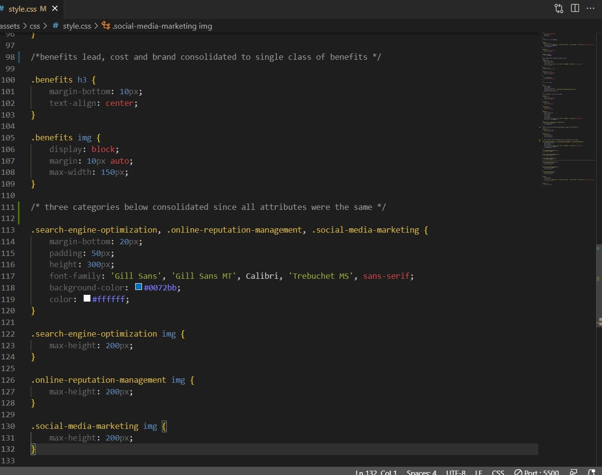
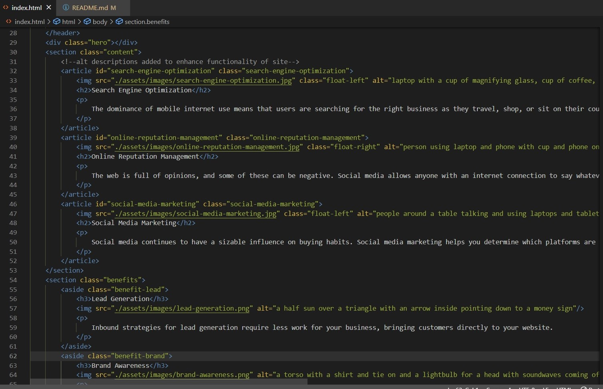

# Horiseon Refactor

## Description

This repository is where I refactored the existing code for the Horiseon website. The HTML was edited to reflect semantic HTML properties, and the CSS was cleaned up to be easier to read while maintaining the function of the webpage. Alt descriptions for each image on the page were added in order to improve SEO ranking and also to make the page more accessible for individuals using screen readers. I learned the value of commentary throughout the HTML and CSS, as well as the benefit to having a clean and consolidated CSS file. 

## Usage

Here is an example of some of the CSS commentary noting what changes were made: 

Here is an example of alt text being added to the images embedded in the HTML file: 

## Credits

Andrew Tirpok for his help with getting the gears rolling in my brain to undertake this project. 

